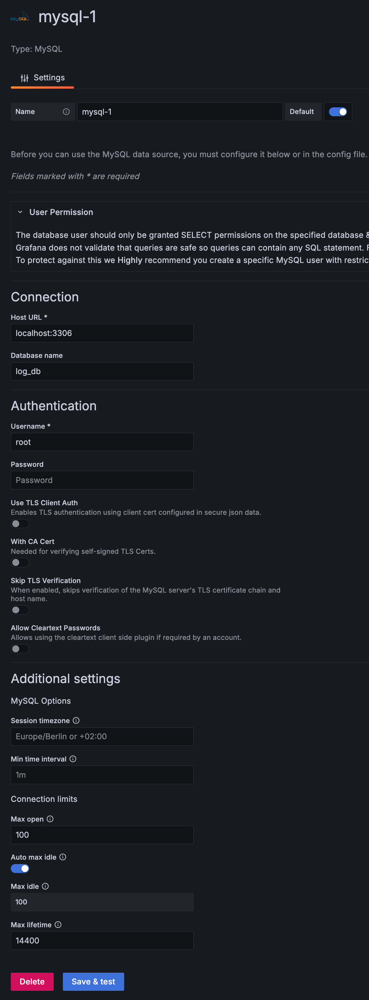
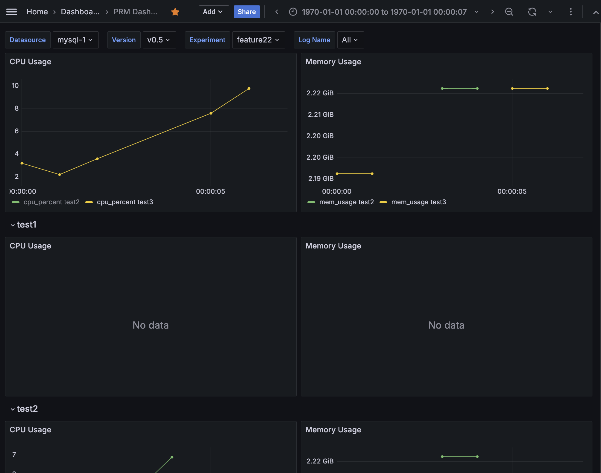

# Prerequisite
- Python 3
- [psutil](https://psutil.readthedocs.io/en/latest/) and [pywin32](https://github.com/mhammond/pywin32) packages
  ```bash
  $ pip3 install psutil==5.9.4
  $ pip3 install pywin32==306  # only in windows
  ```
  - Calculates a process's CPU utilization and memory usage in Windows by using pywin32.
    - CPU utilization is based on `(process time (kernel and user) / elapsed time)`.
  - Calculates a process's cpu util. and memory usage in other operating systems by using psutil.

<!--  - Calculates a process's cpu utilization in Windows by using [GetProcessTimes](https://learn.microsoft.com/en-us/windows/win32/api/processthreadsapi/nf-processthreadsapi-getprocesstimes)
    - [refer](https://learn.microsoft.com/en-us/answers/questions/1000290/how-is-the-process-cpu-usage-in-task-manager-calcu)
    - But, we can try other APIs (e.g., [Pdh Performance Counter](https://learn.microsoft.com/en-us/answers/questions/69560/msdn-forum-cpu-usage-caculated-by-windows-api-is-n)).-->

# How to use
```bash
# monitor reousrce usage every 1 sec in 1 mininute
$ python3 prm.py -n slack
# monitor resource usage every 10 secs in 5 minutes
$ python3 prm.py -n slack -i 10 -d 5
# monitor resource usage every 10 secs in 5 minutes silently
$ python3 prm.py -n slack -i 10 -d 5 -s
```
- If `PermissionError: [Errno 13]` exception occurs, use `sudo`.
  - e.g., `sudo python3 prm.py ...`

- Command usage
  ```bash
  $ python3 prm.py --help
  usage: prm.py [-h] -n NAME [-i INTERVAL] [-d DURATION] [-o OUTPUT_PATH] [-s]
  
  optional arguments:
    -h, --help            show this help message and exit
    -n NAME, --name NAME  Target process name (case insensitive) (default: None)
    -i INTERVAL, --interval INTERVAL
                          Collection interval (sec) (default: 1.0)
    -d DURATION, --duration DURATION
                          Total duration (min) (default: 1.0)
    -o OUTPUT_PATH, --output_path OUTPUT_PATH
                          The output CSV file path (default: 20230327_012916.csv)
    -s, --silent          No stdout (default: False)
  ```

# Visualization with Grafana for MacOS
- MySQL & Grafana
  ```bash
  $ brew update
  $ brew install mysql grafana
  $ brew services start mysql
  $ brew services start grafana
  ```
- Python Packages
  ```bash
  $ pip install 'polars[sqlalchemy]==0.20.26' 'pymysql==1.1.0' 'pandas>=1.5' 'pyarrow>=8.0.0'
  ```
- Insert Logs into MySQL
  ```bash
  $ python ingest.py --help
  usage: ingest.py [-h] -f LOG_FILE -l LOG_NAME -n EXP_NAME -V VERSION [-H MYSQL_HOST] [-p MYSQL_PORT] [-u MYSQL_USER] [-d MYSQL_DATABASE] [-t MYSQL_TABLE]

  optional arguments:
    -h, --help            show this help message and exit
    -f LOG_FILE, --log_file LOG_FILE
                          Log file path (CSV) (default: None)
    -l LOG_NAME, --log_name LOG_NAME
                          Log name (default: None)
    -n EXP_NAME, --exp_name EXP_NAME
                          Experiment name (default: None)
    -V VERSION, --version VERSION
                          Version (default: None)
    -H MYSQL_HOST, --mysql_host MYSQL_HOST
    -p MYSQL_PORT, --mysql_port MYSQL_PORT
    -u MYSQL_USER, --mysql_user MYSQL_USER
    -d MYSQL_DATABASE, --mysql_database MYSQL_DATABASE
    -t MYSQL_TABLE, --mysql_table MYSQL_TABLE
  ```
  - Example
    ```bash
    $ python ingest.py --log_file 20240517_181613.csv --version v0.5 --exp_name feature22 --log_name test3
    ```
- Grafana Settings
  - New Datasource: http://localhost:3000/connections/datasources/new
    
  - Import Dashboard: http://localhost:3000/dashboard/import
    [PRM_Dashbaord](./res/PRM_Dashboard-1715942560789.json)
- Dashboard Screenshot
  
